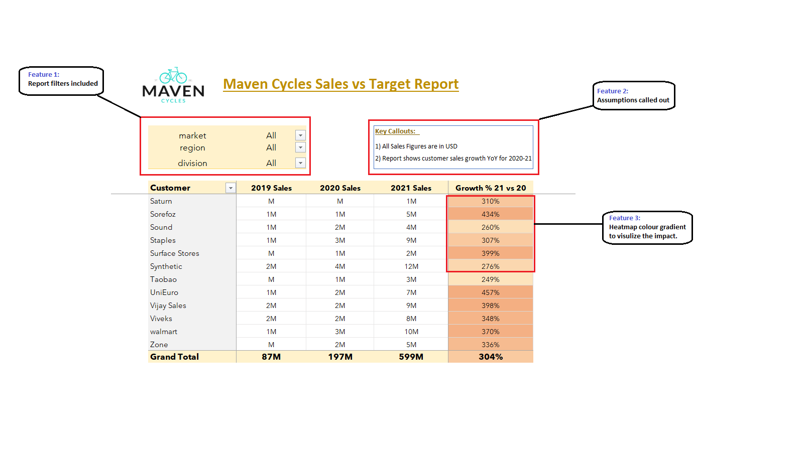

# FinnyRobin.github.io
## Sales Report :

- **Project objective:** 

    **1.** Create a _[customer performance report](https://github.com/FinnyRobin/FinnyRobin.github.io/blob/main/Customer-Performance-Report.pdf)_ 

    **2.** Conduct a comprehensive comparison between _[market performance and sales targets](https://github.com/FinnyRobin/FinnyRobin.github.io/blob/main/Market%20performance%20vs%20Targets%202021.pdf)_

- **Purpose of sales analytics:** Empower businesses to monitor and evaluate their sales activities and performance.

- **Importance of analyzing sales data:** Identify sales patterns and track key performance indicators (KPIs).

- **Role of reports:** Determine effective customer discounts, facilitate negotiations with consumers, and identify potential business expansion opportunities in promising countries.
  
Power Pivot Report Features |
:--------------------------:|

## Finance Report :

- **Project objective:** 

    **1.** Create Profit and Loss (P&L) reports by _[Fiscal Year](https://github.com/FinnyRobin/FinnyRobin.github.io/blob/main/P%26L%20By%20Fiscal%20Year.pdf)_ & _[Months](https://github.com/FinnyRobin/FinnyRobin.github.io/blob/main/P%26L%20by%20Months.pdf)_ 

   **2.** Create Profit and Loss (P&L) reports by _[Markets](https://github.com/FinnyRobin/FinnyRobin.github.io/blob/main/Profit%20%26%20Loss%20by%20Market.pdf)_

- **Purpose of Finance analytics:** Evaluation of financial performance, support decision-making, and facilitate communication with stakeholders.

- **Importance of analyzing Finance data:** Aid in benchmarking against industry peers and previous periods Foundation for budgeting and forecasting.

- **Role of reports:** Align financial planning with strategic goals Instill confidence in the organization's financial outlook.

Data Model Used |
:--------------:|

**Note:** Fiscal year considered is from Sep-Aug

## Technical & Soft Skills:
- [x]	Proficiency in ETL methodology (Extract, Transform, Load).
- [x]	Skills to generate a date table using Power Query.
- [x]	Ability to derive fiscal months and quarters.
- [x]	Establishing data model relationships with Power Pivot.
- [x]	Proficiency in incorporating supplementary data into an existing data model.
- [x]	Utilizing DAX to create calculated columns.

## Soft Skills:
- [x]	Refined understanding of Sales & Finance Reports
- [x]	Designing user-centric reports with empathy in mind.
- [x]	Optimization of report generation through meticulous fine-tuning.
- [x]	Developing a systematic approach to devising a report building plan.
